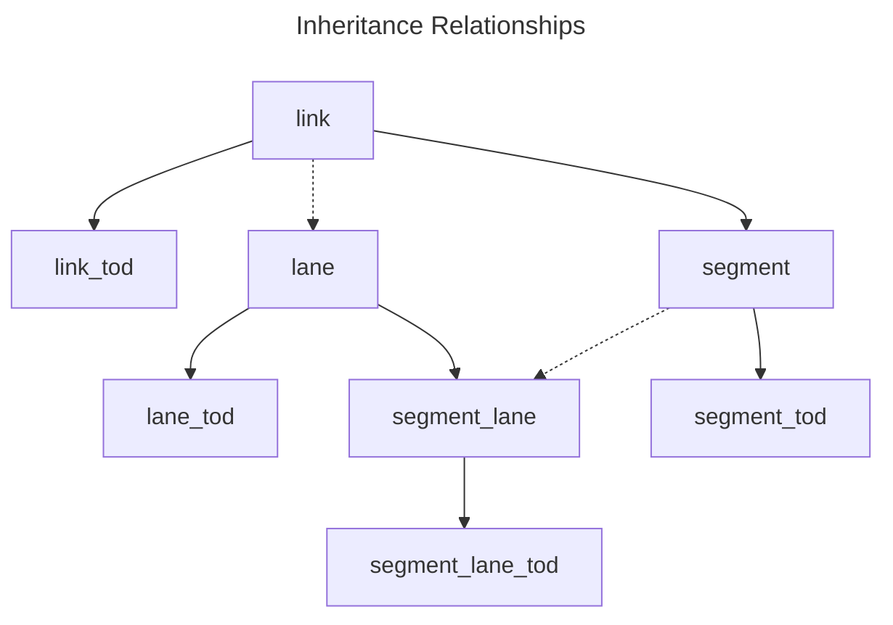
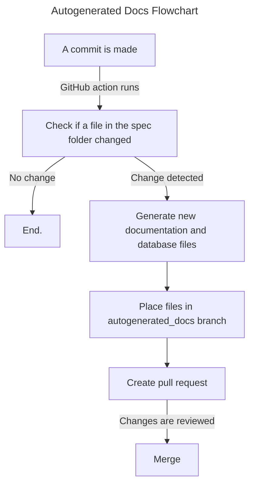

# General Modeling Network Specification: Spec Documentation
The General Modeling Network Specification (GMNS) defines a common machine (and human) readable format for sharing routable road network files. It is designed to be used in multi-modal static and dynamic transportation planning and operations models. Here, you can find human-readable information on the possible values in the specification. For more information on GMNS, please view the [repository README.md file](https://github.com/zephyr-data-specs/GMNS/tree/main/README.md)

## Specification Tables

### Basic Data Elements
- [`node`](spec/node.md)  
- [`link`](spec/link.md)
- [`geometry`](spec/geometry.md)       
- [`zone`](spec/zone.md)

### Advanced Data Elements
- [`segment`](spec/segment.md)  
- [`location`](spec/location.md)  
- [`lane`](spec/lane.md)  
- [`segment_lane`](spec/segment_lane.md)
- [`link_tod`](spec/link_tod.md)  
- [`segment_tod`](spec/segment_tod.md)  
- [`lane_tod`](spec/lane_tod.md)  
- [`segment_lane_tod`](spec/segment_lane_tod.md)  
- [`movement`](spec/movement.md)  
- [`movement_tod`](spec/movement_tod.md) 
- [`signal_controller`](spec/signal_controller.md)
- [`signal_coordination`](spec/signal_coordination.md)
- [`signal_detector`](spec/signal_detector.md)  
- [`signal_phase_mvmt`](spec/signal_phase_mvmt.md)  
- [`signal_timing_plan`](spec/signal_timing_plan.md)
- [`signal_timing_phase`](spec/signal_timing_phase.md)
- [`curb_seg`](spec/curb_seg.md)

### Configuration
- [`config`](spec/config.md)
- [`use_definition`](spec/use_definition.md)
- [`use_group`](spec/use_group.md)
- [`time_set_definition`](spec/time_set_definitions.md)

## Additional Table Details

### Lanes

The lane file allocates portions of the physical right-of-way that might be used for travel. It might be a travel lane, bike lane, or a parking lane. Lanes can be determined by examining a high-resolution aerial photo. Lanes only are included in directed links; undirected links are assumed to have no lane controls or directionality. Lanes are uniquely identified by:
  - Associated link
  - Lane number

<!-- If a lane is added, dropped, or changes properties along the link, those changes are recorded on the [`segment_link`](spec/segment_link.md) table. -->

Lanes are numbered sequentially, starting at either the centerline (on a two-way street) or the left shoulder (on a one-way street or divided highway with two centerlines), and ascending towards the right edge of the road. In cases where lanes are numbered starting at the centerline (which most often occurs on a two-way undivided road), the centerline itself is treated as lane 0, with 0 width. In this case, lane that is on the opposing traffic side of the centerline (e.g., a peak hour contra-flow lane or a left turn lane), may be numbered as -1. If there are dual-left turn lanes on the opposing traffic side of the centerline, they may be labeled -2 and -1.

  
_Lanes leading to an intersection. Source: MATSim documentation (2016), with text added by Volpe._

It is challenging to represent a lane that has different purposes on different sections of a lane (e.g., a merge lane downstream of a signal, which then becomes a parking lane, and then becomes a right-turn pocket). [`segment`](spec/segment.md) and [`segment_lane`](spec/segment_lane.md) are used to identify the places where lane transitions occur.

The lane file includes the typical allocation of lanes. It does not include special time-of-day restrictions. These are covered in the optional [`link_tod`](spec/link_tod.md) file.

To enable special purpose lanes (e.g., car pool, separated bicycle) to be coded without use of a separate link, optional Barrier fields indicate whether a vehicle can move to the right, or to the left out of a lane. Values for the Barrier field include:
  - `"none"`: The default. Indicates that a vehicle can change lanes,
    provided that the vehicle-type is permitted in the destination lane
  - `"regulatory"`: There is a regulatory prohibition (e.g., a double-white
    solid line) against changing lanes, but no physical barrier
  - `"physical"`: A physical barrier (e.g., a curb, Jersey barrier) is in
    place.

### Link

A link is an edge in a network, defined by the nodes it travels from and to. It may have associated geometry information. Links have three types of attributes:
  - Those that define the physical location of the link (e.g., shape information, length, width)
  - Those that define the link's directionality: `from_node`, `to_node`
  - Those that define properties in the direction of travel: capacity,
    free flow speed, number of lanes, permitted uses, grade, facility type

### Segment

A road segment is a portion of a link. It is similar to a linear event in ESRI, and is typically used to indicate where the number of lanes (or other properties) changes on a link. The following fields are used to define a segment:
  - `link_id`
  - `ref_node_id`, the node from which the linear referencing starts (typically the from_node of the link)
  - `start_lr`, the start of the segment, measured as distance from the `ref_node`
  - `end_lr`, the end of the segment, measured as distance from the `ref_node`

For example, a 5000 foot hill climbing lane on link 102 that begins 1000 feet downstream of Node 12, would have the following segment:
  - `link_id` = 102
  - `ref_node_id` = 12
  - `start_lr` = 1000 feet
  - `end_lr` = 6000 feet

Most of the fields in the segment table are simply inherited from the [`link`](spec/link.md) table. When values are present in these fields, these values override the values in the link table along the segment.

If segments overlap, but one is contained within the other, the smaller segment’s characteristics should prevail. Partial overlap of segments is more complicated; validation tools should throw a warning in this scenario.

### Signals

Representation of traffic controls (e.g., stop signs, signals, etc.) includes several considerations:  
- For static networks, the node may include the type of traffic control (e.g., unknown, no control, yield, 4-way stop, signal, 2-way stop, roundabout)
- The link includes functional class and number of lanes
- With basic information on the node and link, a reasonable approximation of traffic control configuration (e.g., which approach is being stopped) for static models can be made from the above information
- For dynamic models, basic control information can be included in the movement file.  Controls include unknown, no control, yield, 4-way stop, 2-way stop, signal, signal_with_RTOR. Note that different movements and lanes at an intersection may have different controls (e.g., a Stop Except Right Turn sign)   

Traffic signals call for several additional files:
- [`signal_controller`](spec/signal_controller.md) has one record for each signal controller.  Typically, each node that represents an intersection has one signal controller, but there are cases where one signal controller might be associated with several nodes (e.g.,  two sides of a divided highway at a crossroads).  
- A controller will be associated with at least one timing plan. When signals are coordinated, a signal timing plan may be associated with a second controller through the [`signal_coordination`](spec/signal_coordination.md) file.
- A signal timing phase record using table [`signal_timing_phase`](spec/signal_timing_phase.md) indicates the ring, barrier, and position (RBP) for each phase of the signal. A signal phase is associated with at least one signal timing plan in table [`signal_timing_plan`](spec/signal_timing_plan.md). If timing plans vary by time of day or day or week, the signal phase will be associated with multiple timing plans.  
- Each signal phase is associated with a controller and with one or more movements (for traffic movements) or links (for crosswalks) that may move on that phase.  Similarly, movements may move on more than one signal phase. These are indicated in the [`signal_phase_mvmt`](spec/signal_phase_mvmt.md) table. 
- [`signal_detector`](spec/signal_detector.md) is an optional file for detectors (used for actuated signals)

### Movement

The movement file describes how inbound and outbound `road_links` connect at an intersection. The simplified structure for `offroad_links` implies that travel can occur from a given offroad link to any offroad link sharing a node (including U-turn movements); no movements table is necessary.

## Configuration
The following units are recommended:
- Short lengths (linear references, lane widths, etc.): feet or meters
- Long lengths (link lengths): miles or km
- Speed: miles per hour or km / hr

These are defined for each dataset in the [`config`](spec/config.md) file.

The specification also provides for optional tables to define datatypes for use and time sets.

### Use Definition and Use Group
Two classes define the characteristics of each use, and of the items in a use set. 
- The [`use_definition`](spec/use_definition.md) file defines the characteristics of each vehicle type or non-travel purpose (e.g., a shoulder or parking lane). A two-way left turn lane (TWLTL) is also a use.
- The optional [`use_group`](spec/use_group.md) file defines groupings of uses, to reduce the size of the Allowed_Uses lists in the other tables.

### Time Set Definitions
Four time-of-day files handle day-of-week and time-of-day restrictions and other attributes on links, segments, lanes, lane_segments and movements.
- [`time_set_definitions`](spec/time_set_definitions.md) currently allows for times of day to be represented in the following format: 
    - `XXXXXXXX_HHMM_HHMM`, where `XXXXXXXX` is a bitmap of days of the week, Sunday-Saturday, Holiday. The HHMM are the start and end times. This is adapted from the Synchro Universal Traffic Data Format (UTDF) TimeOfDay table structure. For example, Monday-Friday 0700-0900 would be `01111100_0700_0900`. 
    - Alternatively, these can be coded in the following [`time_set_definitions`](spec/time_set_definitions.md) table and `timeday_id` referenced instead of this format. 
- [`link_tod`](spec/link.md) is an optional file that handles day-of-week and time-of-day restrictions on links. It is used for tolls (which may differ by time-of-day), and part-time changes in link capacity. Since tolls often vary by time of day, they are placed in this file.
- [`segment_tod`](spec/segment_tod.md) is an optional file that handles day-of-week and time-of-day restrictions on segments. It is used for part-time changes in segment capacity and number of lanes.
- [`lane_tod`](spec/lane_tod.md)
- [`segment_lane_tod`](spec/segment_lane_tod.md)

Ad hoc fields, such as notes, may also be added to any of these tables. A full specification of the data package may be viewed [here](spec/README.md).

## Inheritance Relationship Diagram
<!--  -->
Solid lines indicate a "parent-child" relationships; child tables should include all fields from parent tables, and inherit field values left blank on the child. Dotted lines indicate other relationships.

## Documentation Generation

This documentation is automatically generated by a GitHub action. It performs the following actions:
1. The action first checks if there is a difference in any file in the [`spec` folder](https://github.com/zephyr-data-specs/GMNS/tree/main/spec) from one commit to the next. If so, it proceeds.
2. After performing the necessary setup, the action automatically runs the [`generate.py`](https://github.com/zephyr-data-specs/GMNS/blob/main/scripts/generate.py) script, which does the following:
   1. Combine schema files with relevant data from [`datapackage.json`](https://github.com/zephyr-data-specs/GMNS/tree/main/spec/datapackage.json) to generate individual documentation using [Frictionless Framework](https://framework.frictionlessdata.io/), then combine everything to create [`README.md`](spec/README.md). All generated markdown files will be placed in the [`docs/spec` folder](https://github.com/zephyr-data-specs/GMNS/tree/main/spec).
   2. Remove old [`gmns.sqlite`](https://github.com/zephyr-data-specs/GMNS/blob/main/usage/database/gmns.sqlite) and SQL files and use Frictionless again to generate new DB file. Query the new DB for the schema of each table to generate SQL files.
3. Create a new `autogenerated_docs` branch with all the new files and create a pull request

We then manually review the pull request for accuracy, then merge.

