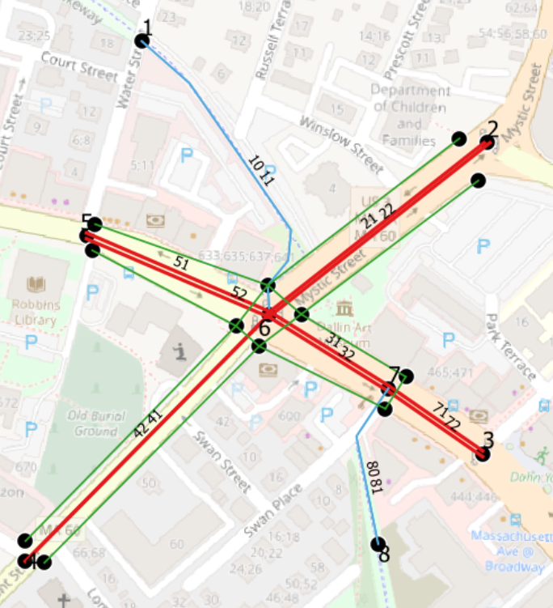
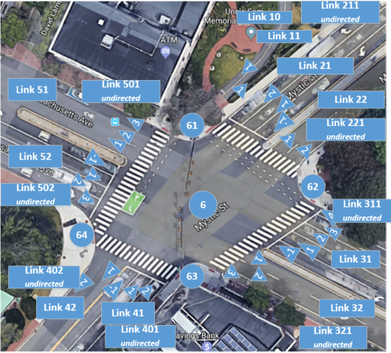
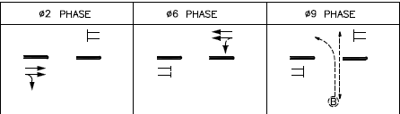

# Arlington Center, Arlington, MA

:warning: Several errors have been intentionally introduced into this example to demonstrate the utility of the [Format Validation notebook](../../Validation_Tools/Format_Validation.ipynb). If you're not testing that notebook, you probably want the [cleaned version](../Arlington_Signals) instead.

This example shows the GMNS specification implemented at two signalized intersections where [the Minuteman Bikeway crosses Massachusetts Avenue](https://www.google.com/maps/@42.4152638,-71.1524763,19z) in Arlington.  It includes:
- Intermodal features:  shared use path, on-road bicycle accommodation, sidewalks, and bus stops
- Two traffic signals that are coordinated at certain times of the day
- Coordination and timing plans for AM peak, PM peak and Saturday, with actuated operation at other times

Signal phases and timings were taken from the engineering plans for the [Arlington Center Safe Travel Project](https://www.arlingtonma.gov/departments/planning-community-development/transportation-planning).  Note that they do not reflect the current phasings and timings; they are only used to illustrate how the signal files are used.

Nodes and links are shown below, both as an overview, and as a close-up of the two signalized intersections at nodes 6 and 7.   The blue links represent the shared use path, red links accommodate motor vehicles and bicycles, the green links are sidewalks and crosswalks.  Coordinate system is EPSG:32619 - WGS 84 / UTM zone 19N. User-defined fields  are prefixed with `opt_`, e.g. `opt_comment`.

Note that the street at Node 7 (Swan Place) is a local street that would probably not be included in a regional planning model.  While this example includes bicycle/pedestrian traffic on Swan Place (it provides the connection to the Minuteman Bikeway), it does not include motor vehicle traffic on Swan Place.  

Basemaps: OpenStreetMap contributors, CC-BY-SA.

The next figure shows segments and locations.  The segments represent pocket lanes, and are numbered in square boxes, with lines extending towards the other end of the segment. The locations represent driveways or bus stops, and are numbered in diamonds.  Locations 2, 3 and 8 are driveways; locations 11 and 12 are bus stops.  

Basemap: OpenStreetMap contributors, CC-BY-SA.

The next figure shows the node (numbers in circles), link and lane numbering at the main intersection at node 6. 

Basemap: Google Maps.

The figure below shows signal phasing and movements at node 6. 

The figure below shows signal phasing and movements at node 7.  

