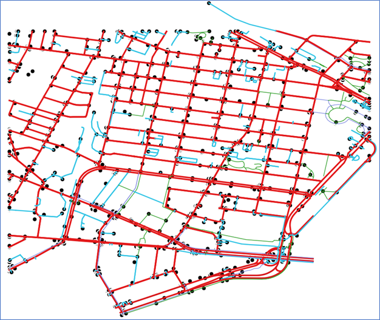
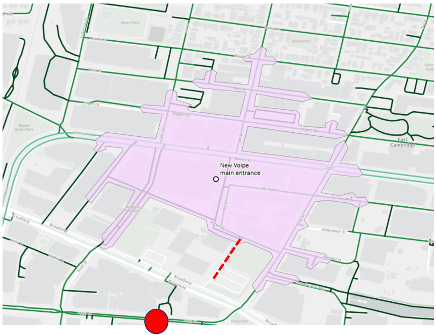

# Multimodal Modeling on an Urban Network

This node-link example greatly expands the [Cambridge Intersection example](../Cambridge_Intersection/readme.md) to enable modeling of multimodal access to destinations. The area is shown in the figure below (basemap: [OpenStreetMap](https://www.openstreetmap.org/copyright))

The approximate extent of the 1.4 square mile area is:
|            | Latitude | Longitude |
|------------|----------|-----------|
|Lower left  | -71.0928 |  42.3589  |
|Upper right | -71.0740 |  42.3747  |

The area includes
* A major employment center (Kendall Square)
* The densely populated East Cambridge residential neighborhood
* Two transit stations (Kendall / MIT and Lechmere)
* Sidewalks
* Off road bikeways and walking paths
* Several types of on-road bicycle accommodation, ranging from painted bike lanes to a two-way cycle track.  

The resulting GMNS network includes 1346 nodes and 2963 links, as shown below.  Red links are open to motor vehicles.  They include adjoining sidewalks and, in some cases, bike lanes.  The light blue links are limited to bicycles and pedestrians.  A small number of dark blue links are limited to bicycles.  The green links are limited to pedestrians.  

The figure below is a closeup of the area just north of the Kendall / MIT subway station, between Main and Binney Streets, showing some of the multimodal features of this network.   They include
* Several (red) road links, both divided and undivided, tagged with pedestrian and bicycle accommodation
* Shared pedestrian / bicycle links (light blue)
* Two bicycle-only links (darker blue), including an off road path (with parallel pedestrian path), a two-way cycle track on a street right-of-way, and a short contraflow bike lane.  
* Several pedestrian-only links that are not sidewalks (green).  They include the walkway by the Volpe Center parking lot, a mid-block crosswalk, and a passage through a hotel lobby that provides a shortcut to the subway station.  

GMNS is focused on the supply side of travel modeling.  It represents street infrastructure and policies, including, for example, the number of lanes, locations of transit stops, bike and pedestrian accommodation, and the types of uses allowed on each link.  If the user has the data, it can represent more detailed information, such as sidewalk condition and accessibility for persons with disabilities.  

For travel modeling, additional information, that goes beyond GMNS, is needed on both demand and supply-demand interaction.  Demand information includes both desired trips and traveler characteristics (e.g., child bicyclist versus adult bicyclist).  The supply-demand interaction includes the effects of travel volume and speeds on the desirability of certain links, and the interaction of traveler characteristics and provided accommodation.  These may be represented as link impedances.  For example, a busy street without a bike lane may have a greater impedance for bicyclists than a less busy street, or a street with bicycle accommodation.  Since the GMNS specification allows user defined fields, these impedances could be added directly to the network (although they are not part of GMNS).  For this analysis, the following fields were added to the link table.  They have the prefix `u_` to indicate that they are user defined fields:

| Field              | Type     | Notes     |
|--------------------|----------|-----------|
| u_bike_speed       | NUMERIC  |  Average bicycle speed is adjusted depending on the attractiveness of the facility.  More attractive facilities are “faster”,  less attractive facilities are “slower”, unusable facilities have a speed of 0|
| u_walk_speed       | NUMERIC  |  Average walking speed is adjusted depending on the attractiveness of the facility.  More attractive facilities are “faster”,  less attractive facilities are “slower”, unusable facilities have a speed of 0 |
| u_bike_travel_time | NUMERIC  |  Calculated based on speed and link length |
| u_walk_travel_time | NUMERIC  |  Calculated based on speed and link length |

The following example demonstrates how these values could be applied. The Volpe Center facility recently relocated so that its new main entrance is approximately 200 meters north of its original location, further from the nearest subway station. A walkway currently exists through the old facility’s parking lot which reduces the distance a pedestrian would have to travel to the subway. The following figures show the 5-minute walkshed from the new Volpe building, and the effect of maintaining the walkway alongside the parking lot for the old building (dashed red line).  The green shaded area in the second figure shows the increase in locations that can be reached.   The red dot is the subway station main entrance.  

Without the connection through the parking lot:

With the connection through the Volpe parking lot:

