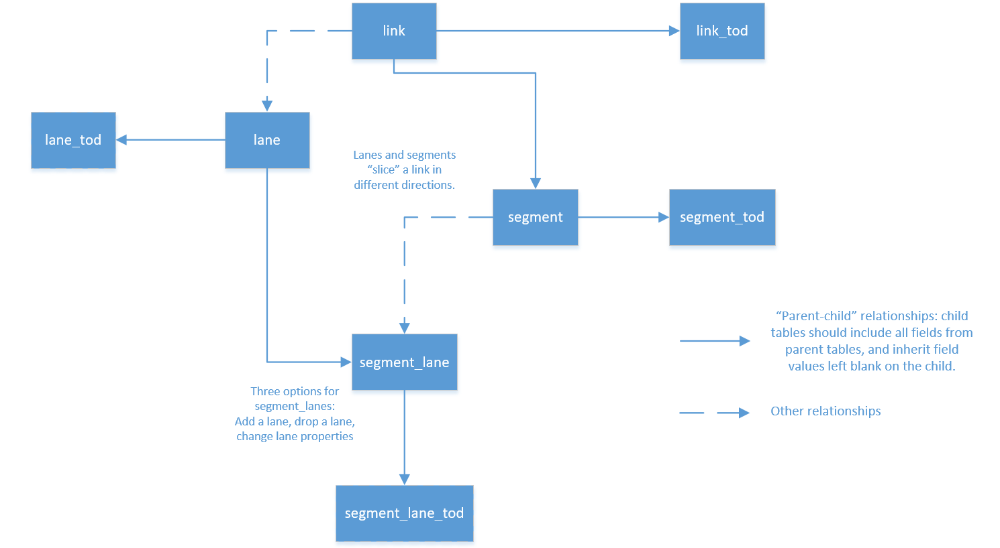

# General Modeling Network Specification

This folder contains a machine-readable version of GMNS, in a `.json` format compatible with the [frictionless data](https://specs.frictionlessdata.io/table-schema/) table schema standards. For more detailed information about each table, go to the [Markdown version](../docs/spec/README.md).

## Specification Tables
[Specification Overview](gmns.spec.json)
### Basic Data Elements
- [node](node.schema.json)  
- [link](link.schema.json)
- [geometry](geometry.schema.json)       
- [zone](zone.schema.json)
- [config](config.schema.json)
### Advanced Data Elements
- [segment](segment.schema.json)  
- [location](location.schema.json)  
- [lane](lane.schema.json)  
- [segment_lane](segment_lane.schema.json)
- [link_tod](link_tod.schema.json)  
- [segment_tod](segment_tod.schema.json)  
- [lane_tod](lane_tod.schema.json)  
- [segment_lane_tod](segment_lane_tod.schema.json)  
- [movement](movement.schema.json)  
- [movement_tod](movement_tod.schema.json) 
- [signal_controller](signal_controller.schema.json)
- [signal_coordination](signal_coordination.schema.json)
- [signal_detector](signal_detector.schema.json)  
- [signal_phase_mvmt](signal_phase_mvmt.schema.json)  
- [signal_timing_plan](signal_timing_plan.schema.json)
- [signal_timing_phase](signal_timing_phase.schema.json)  
- [time_set_definitions](time_set_definitions.schema.json)
- [use_definition](use_definition.schema.json)
- [use_group](use_group.schema.json)
- [curb_seg](curb_seg.schema.json)

## Inheritance relationships

